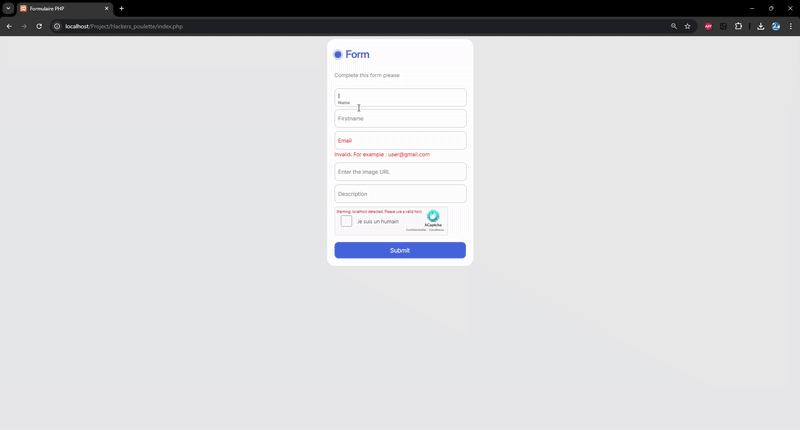

# Hackers Poulette - Contact Form Project 🛡️

## Introduction
This project is a **secure contact form** that allows users to submit inquiries while ensuring **data validation and security**. It includes both **client-side and server-side validation** to protect against malicious input and integrates **hCaptcha** to prevent spam.

## Features ✨
- **Email Sending with SendGrid**: Sends confirmation or inquiry emails securely.
- **User-Friendly Contact Form**: Simple and intuitive interface.
- **Client-Side Validation (JavaScript)**: Ensures correct input before submission.
- **Server-Side Validation (PHP)**: Prevents SQL injection, XSS attacks, and validates all user input.
- **Database Integration (PHP & MySQL)**: Stores form submissions securely.
- **hCaptcha Integration**: Adds an extra layer of bot protection.

## DEMO 🎥

## Technologies Used 🛠️
- **SendGrid (PHP Library)** – Handles email sending securely and efficiently.
- **HTML, CSS** – For the frontend layout and styling.
- **JavaScript** – Client-side form validation.
- **PHP** – Backend processing, server-side validation, and database interaction.
- **MySQL** – Database for storing submitted form data.
- **hCaptcha API** – Protects against spam and automated bots.

## Security Measures 🔒
- **Prepared Statements**: Prevents SQL injection.
- **Input Sanitization**: Protects against XSS attacks.
- **hCaptcha**: Stops bots from submitting spam.
- **Server-Side Validation**: Ensures only valid data is accepted.

---

This project helped me strengthen my understanding of **web security, form validation, and API integration**. 🚀
